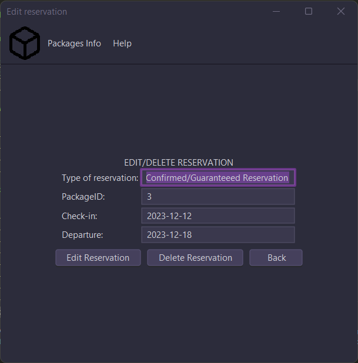
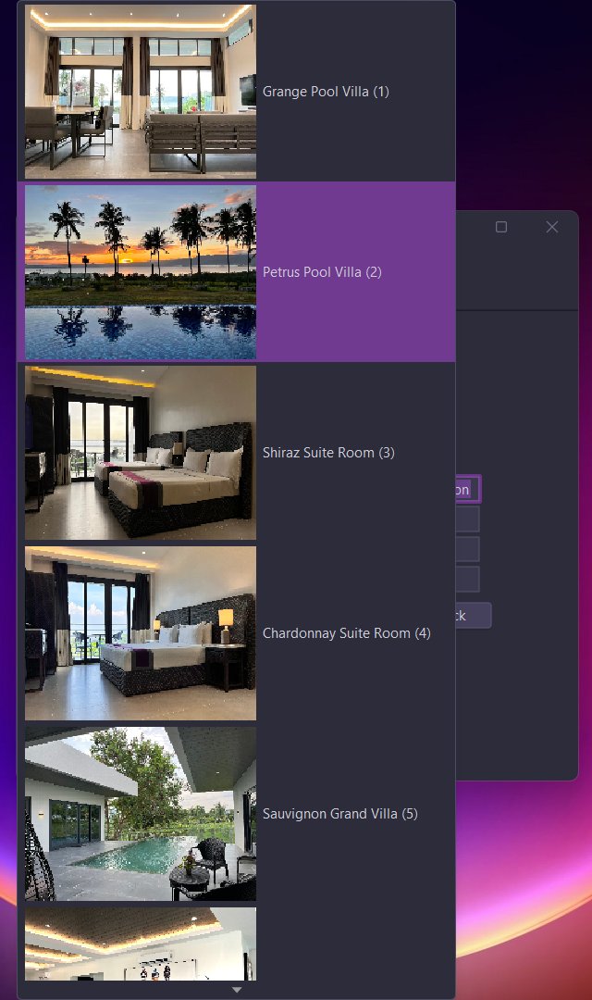
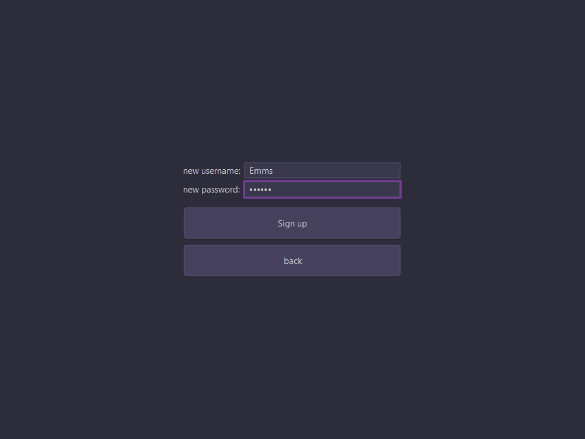
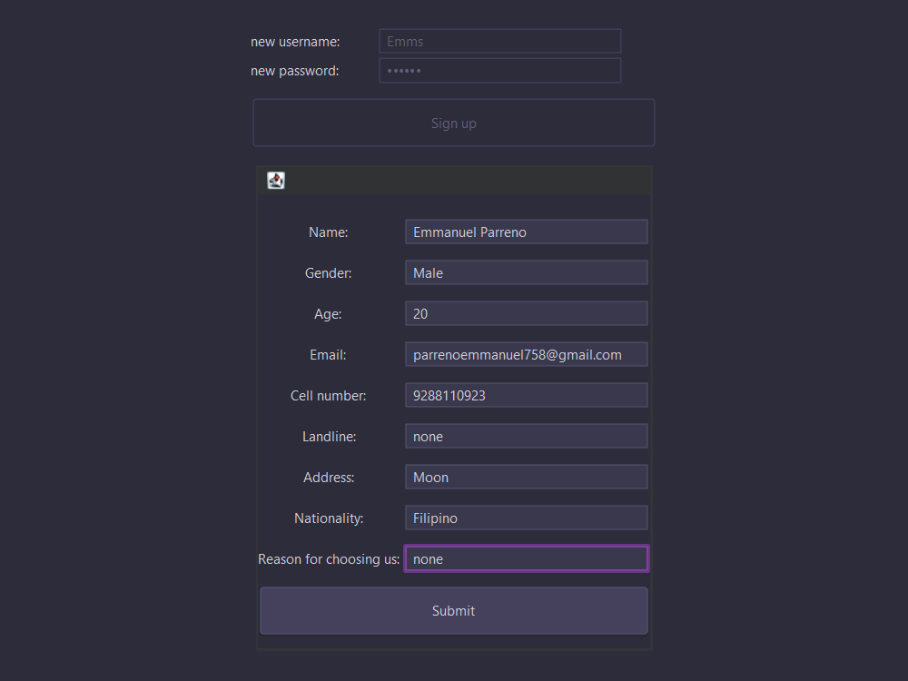
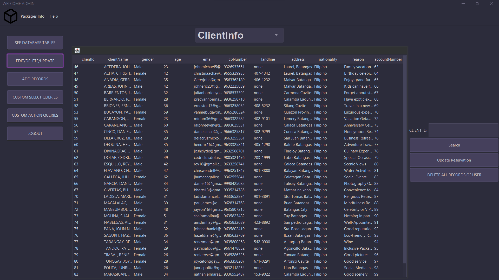

# RESERVATION SYSTEM FOR VINEYARD, TANAUAN

##### This project is not an official project of the Vineyard, Tanauan. The code here is written by Emmanuel Parreno and Cristian Mirana, university students at BSU - Malvar

The program features error handling, oop, date conflict checker using java, etc.

### Screen shots of the Projram:

#### User Window

#### Create Account Window

#### Admin Window

